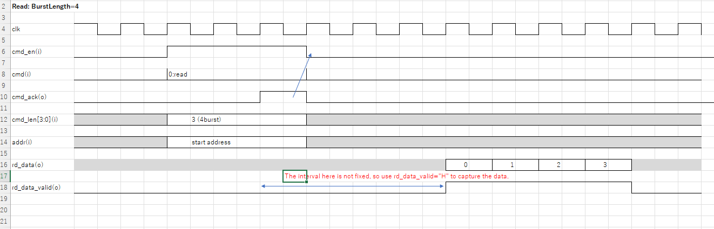
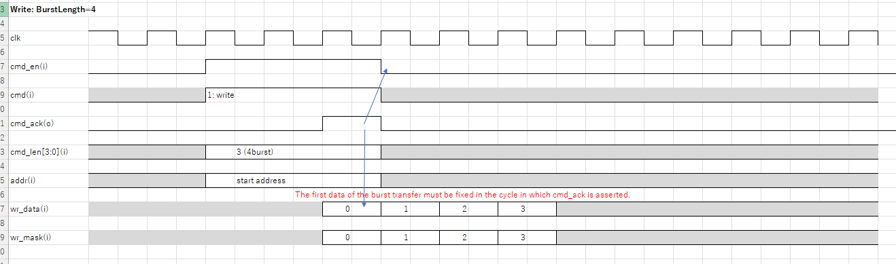

# 概要

TnagNano20Kに内蔵されているSDRAMのコントローラです。  
3chのアービタを同梱しています。  
これにより最大で3つまでのマスターがSDRAMへアクセス可能です。

nand2marioさんが公開されているSDRAMコントローラ  
[https://github.com/nand2mario/sdram-tang-nano-20k](https://github.com/nand2mario/sdram-tang-nano-20k)  
をベースに  

- バースト転送対応
- トランザクション毎にバースト長の変更
- インターフェースをTangNano9KのPSRAMコントローラに似せた  
- 166MHz動作  

といった変更を行っています。

## rtl  
- src/sdramc.v  
  SDRAMコントローラ本体  

- src/sdram_arb.v  
  cmd ifアービタ―

## example
- tb/test_sdramc.v

本サンプルはアービタは利用していません。  
本サンプルで利用しているSDRAMモデルは付属していません。  
SDRAMモデルは、Micron社webサイトでダウンロードが可能なmt48lc2m32b2.vを使っていますので、こちらからダウンロードをお願いします。  
https://www.micron.com/support#SupportDocumentationandDownloads  
ここからSim Models →　
DRAMのカテゴリからSDRAMを選択  
Simulation MdelsのカテゴリからVerilogを選択  
ここからx32のモデルをダウンロード出来ればよいのですが、  
`Verilog(ZIP) - xxxxx`  
と書いたものが沢山あって、どこからダウンロードすれば良いか分かりません。  
適当にダウンロードして、zip内のverilogモデルを見て判断する方法しか分かりませんでした。  
なんどか、ダウンロードして次のファイル名のものがx32品でした。  
`4076mt48lc2m32b2.zip`  
をダウンロードしてください。ブラウザでDownloadの部分へマウスカーソルを当てると、ダウンロード先のファイル名が見えます。  

# SDRAMコントローラ　インターフェース仕様  

| pin name  | I/O | active | description
| ---       | --- | ---    | ---
|**system**||
| resetn    | I   | N      | reset
| clk       | I   | -      | main clock
| clk_sdram | I   | -      | main clock(*1)
| clk_capdq | I   | -      | DQ capture clock(*2)
|**command i/f**||
|cmd_en     | I   | P      | request for transaction
|cmd        | I   | -      | 0: Read, 1:Write
|addr[22:0] | I   | -      | address in byte
|cmd_len[3:0] | I | -      | burst length
|cmd_ack    | O   | P      | accept for transaction
|rd_data[31:0] | O| -      | read data
|rd_data_valid | O| P      | read data valid
|wr_data[31:0] | I| -      | write data
|wr_mask[3:0]  | I| P      | write data mask

\*1 : clk端子に入力するクロックと同一のものを入力してください。  
\*2 : 166MHz動作(近辺)においてはclk端子に入力するクロックと同一のものを入力してください。周波数を遅くした場合にはclkより位相をずらしたものをPLLで生成してDQを正しく取り込めるタイミングを調整する必要があります。  

## command i/f タイミング図
  

  

# SDRAMのACSPECについて  
TangNano20Kに内蔵されているSDRAMのACスペックを記載したドキュメントを見つけることが出来なかった為、Micron社の`MT48LC2M32B2 – 512K x 32 x 4 Banks`を参考にしました。  
当初、166MHz動作なので、tCK=6ns以下のSpeedGradeの`-6`で動作させましたが、メモリ化けが発生したので、`-7`のパラメータを利用しています。  
追い込めば、少し改善出来るかもしれませんが、現状は`-7`パラメータをそのまま利用しています。  
`-7`は143MHz動作なので、MicornのメモリだとSPECオーバーなのですが、GOWINの内蔵SDRAMも同様にSPECオーバーなのかは不明です。とりあえずメモリ化けすることなく動作はしています。  

***
# 参考ドキュメント
- [https://github.com/nand2mario/sdram-tang-nano-20k](https://github.com/nand2mario/sdram-tang-nano-20k)  
- https://media-www.micron.com/-/media/client/global/documents/products/data-sheet/dram/64mb_x32_sdram.pdf?rev=0af7f6403bf14075ab6b3984f549fc15  

